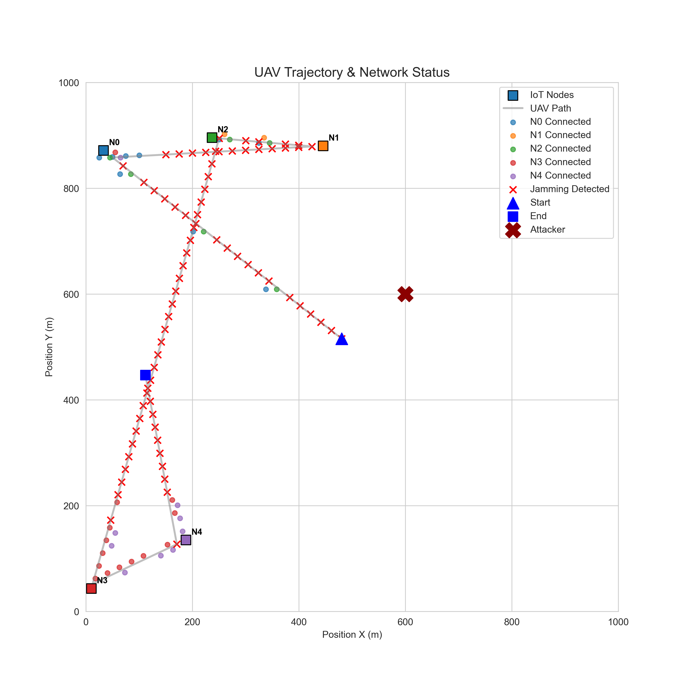
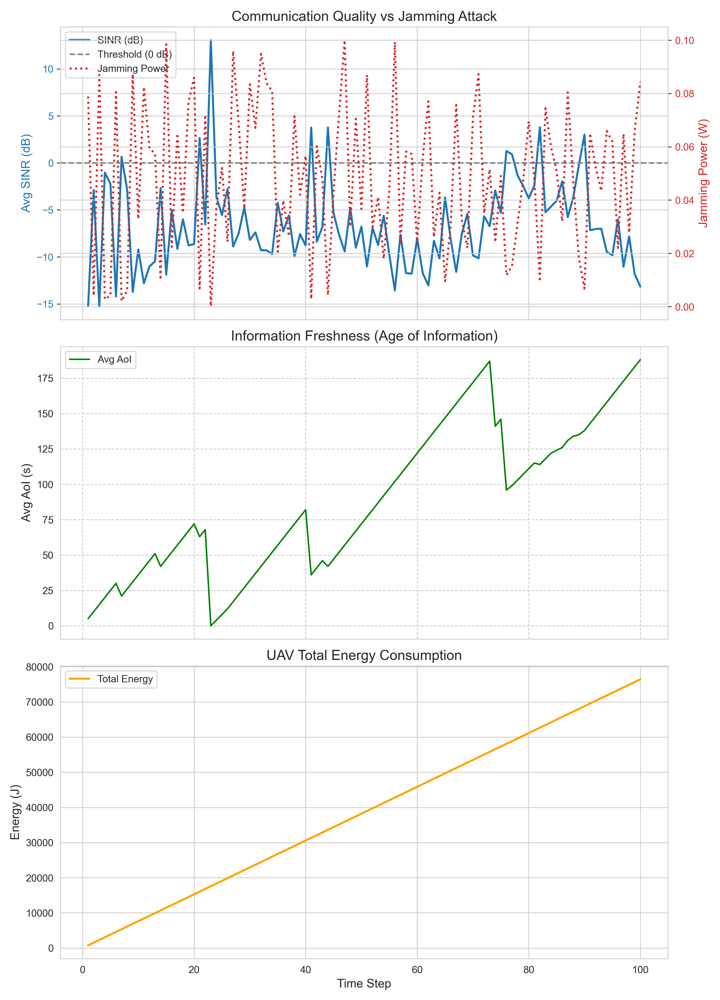
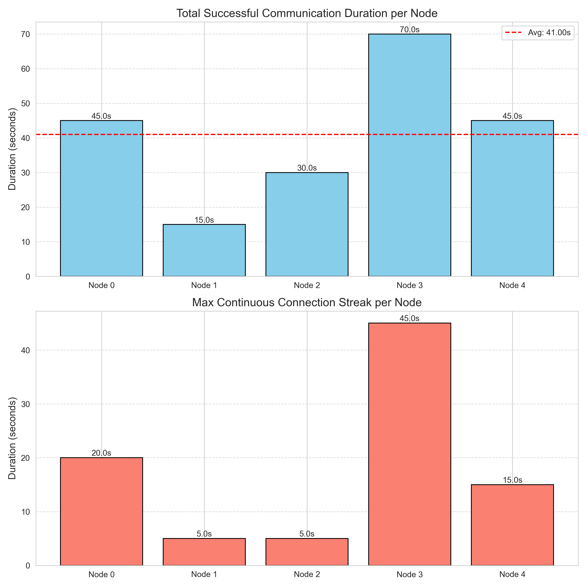

# Simulation Workflow

This document explains the working logic of the `UAV_IoT_Sim` project step by step.

## Project Structure
```
uav-iot-dc-env/
├── confs/              # Configuration Files
│   ├── config.py       # System Configuration (Physics, Delay)
│   ├── env_config.py   # Environment & Scenario Config (Nodes, Power, Speed)
│   ├── model_config.py # Centralized ML Config (GlobalConfig, PPOConfig, DQNConfig, QJCConfig)
├── core/               # Core modules
│   ├── physics.py      # Physics engine
│   └── logger.py       # Logging system
├── simulation/         # Simulation environment
│   ├── pettingzoo_env.py # PettingZoo ParallelEnv
│   ├── controllers.py    # Rule-based controllers (UAV)
│   └── entities.py       # Entity classes
├── visualization/      # Visualization
│   ├── visualization.py # Runtime visualization
│   └── visualizer.py   # Analysis and reporting
├── logs/               # Simulation outputs
├── main.py             # Launcher
├── README.md           # Workflow documentation
└── RAPOR.md            # Technical report (Turkish)
```

## 1. Initialization - `main.py`
When the simulation is started with `python main.py`, the following happens sequentially:

1.  **Logger Setup (`SimulationLogger`)**:
    *   A new folder with the current date/time is created under `logs/` (e.g., `EXP_20260201_200542`).
    *   Simulation parameters are read from `confs/config.py` and `confs/env_config.py`, then saved as `config.json` in this folder.
    
2.  **Environment Setup (`UAV_IoT_PZ_Env`)**:
    *   **Multi-Agent Structure**: The environment is initialized as a PettingZoo `ParallelEnv`.
    *   **Agents**:
        *   `uav_0`: Controlled via velocity commands (currently by `UAVRuleBasedController`).
        *   `jammer_0`: Controlled via power commands.
        *   `node_0`..`node_N`: Passive IoT nodes.
    *   `UAVRuleBasedController`: A controller is instantiated to manage the UAV's waypoint navigation logic.
    
3.  **Visualization (`Visualization`)**:
    *   A Matplotlib window opens, and interactive mode (`plt.ion()`) is enabled.

## 2. Simulation Loop
The simulation runs for a specified number of steps (Default: 100). In each step (`env.step(action)`), the following operations are performed:

### A. Action Selection
*   **UAV (`uav_0`)**: The `UAVRuleBasedController` manages navigation. It moves towards the next waypoint and, upon arrival, **hovers** for 5 seconds (1 step) to collect data before moving to the next node.
*   **Jammer (`jammer_0`)**: A random jamming power (or RL-based action) is selected.
*   **Nodes**: Passive (No-Op).
*   All actions are passed to `env.step(actions)` dictionary.

### B. Physical Calculations (`core/physics.py`)
1.  **UAV Movement**:
    *   The UAV is moved in a circular trajectory (r=200m).
    *   New position and velocity vectors are updated.
2.  **Channel and Communication**:
    *   **UAV -> Node** and **Jammer -> Node** distances are calculated.
    *   Path losses are found using `physics.calculate_path_loss`.
    *   **SINR** (Signal/Noise+Jamming) is calculated for each node.
    *   Instantaneous **Data Rate** is found using the Shannon equation.

### C. State Updates (`simulation/entities.py`)
1.  **Connection Check**: If SINR is below a certain threshold (e.g., 1.0), the node is considered "Jammed".
2.  **Age of Information (AoI)**:
    *   If connected: AoI = 0 (Reset).
    *   If not connected: AoI += time elapsed (Stale).
3.  **Energy Consumption**:
    *   **UAV**: Aerodynamic power consumption based on flight speed is calculated.
    *   **IoT Node**: Costs for data sending and encryption are calculated.

### D. Logging (`core/logger.py`)
At the end of each step, all critical data is buffered:
*   Step No
*   UAV and Attacker Positions
*   For each Node: SINR, AoI, Energy Consumed
*   Attacker's current power

### E. Visualization (`render`)
*   Points on the map are updated.
*   **Jamming Contour**: A dynamic red contour is drawn where SINR < 0 dB, showing the real-time effective jamming zone.
*   Instantaneous step and power information is written to the screen.

## 3. Termination
When the loop ends or is stopped by the user:
1.  **Data Recording**: All data in the buffer is written to the `history.csv` file.
2.  Window is closed.
3.  The location of the log files is printed to the screen.

## 4. Analysis and Visualization - `visualization/visualizer.py`
To graph the results after the simulation ends:
```bash
python visualization/visualizer.py 
# Note: Usually called automatically by main.py
```
This command finds the latest experiment folder and generates the following graphs.

### Interpreting Results (Example)

The following graphs simplify example outputs of a scenario under attack.

#### A. Trajectory and Attack Analysis (`trajectory.png`)


*   **Blue Line**: The path followed by the UAV (Visiting nodes).
*   **Red "X"**: Position of the fixed attacker (Jammer).
*   **Colored Dots**: Successful connection points. Each node has a distinct color (e.g., Node 0 is Blue, Node 1 is Orange).
*   **Red Dot (X)**: Jamming detected (Communication lost due to attack, only shown if ALL connections are lost).
*   **Gray Dot**: Out of Range (Only shown if ALL connections are lost and no jamming).
    *   *Comment:* The concentration of red dots as the UAV approaches the attacker (top right corner) confirms that the Jammer effect increases with proximity.

#### B. Metrics Analysis (`metrics_analysis.png`)


This graph consists of three panels:

1.  **Top Panel (SINR & Jamming):**
    *   **Blue Line (SINR):** Signal quality.
    *   **Red Dashed Line (Jamming Power):** Attacker's power.
    *   *Comment:* When the red line rises (attack increases), the blue line (SINR) experiences sudden drops. Points falling below 0 dB (Gray line) indicate connection loss.

2.  **Middle Panel (Age of Information - AoI):**
    *   **Green Line:** Freshness of information (Lower is better).
    *   *Comment:* A "sawtooth" pattern is seen. When the line climbs upwards (Linear increase), data is not being received (Jamming or distance). The moment the line drops to zero is the moment of successful data transfer.

3.  **Bottom Panel (Energy):**
    *   **Orange Line:** Total energy consumption of the UAV.
    *   *Comment:* Increases cumulatively over time. Changes in slope indicate speed changes (Maneuver).

#### C. Communication Statistics (`advanced_metrics.png`)


1.  **Total Successful Duration:** How long each node maintained instances of valid connection (SINR > Threshold).
2.  **Max Continuous Streak:** The longest uninterrupted specific connection interval for each node.

#### D. Simulation Dashboard
A unified window displaying all the above graphs side-by-side matches for a holistic view of the mission status.

### E. RLLib Bug Fix (Critical)
During development, a `TypeError` was discovered in Ray 2.53.0's DQN implementation. 
*   **Issue:** `ABCMeta` type was not iterable in `_create_local_replay_buffer_if_necessary`.
*   **Fix:** A patch was applied to the local library.
*   **PR:** A Pull Request has been submitted to the `ray-project/ray` repository.
*   **Documentation:** Detailed the issue and fix in `pr.md`.

## 5. Configuration Management (`confs/model_config.py`)

The project uses a centralized configuration system for reproducibility and easy hyperparameter tuning:

### Configuration Classes:

*   **GlobalConfig**: Shared parameters across all algorithms
    *   `RANDOM_SEED`: Random seed for reproducibility (42)
    *   `FLATTEN_ACTIONS`: Action space flattening for DQN compatibility (True)
    *   `TRAIN_ITERATIONS`: Training iterations for all RL algorithms (20)

*   **QJCConfig**: Baseline Q-Learning parameters
    *   Learning rate (TAU_0), discount factor (GAMMA), softmax temperature (TEMP_XI)
    *   Training episodes, save path, max power level

*   **PPOConfig**: PPO training parameters
    *   Learning rate (LR), gamma, batch size, rollout fragment length
    *   Model architecture (`FCNET_HIDDENS = [256, 256]`)
    *   GPU settings (`USE_GPU = True`)

*   **DQNConfig**: DQN training parameters
    *   Learning rate, gamma, batch size, target network update frequency
    *   Replay buffer capacity, Double-Q, Dueling settings
    *   Model architecture and GPU settings

### Benefits:
*   **Single Source of Truth**: All hyperparameters in one file
*   **Easy Experimentation**: Change seed or hyperparameters with one edit
*   **Reproducibility**: Guaranteed consistent random initialization
*   **No Code Duplication**: Eliminates hardcoded values across scripts

### API Stack Fairness:
For fair algorithmic comparison, both PPO and DQN use the **Old API Stack**:
*   **PPO**: Configured with `api_stack(enable_rl_module_and_learner=False)`
*   **DQN**: Naturally uses Old API Stack
*   **Benefit**: Identical GPU reporting, resource allocation, and execution behavior

## 6. GPU Setup (CUDA Support)

### Requirements:
*   NVIDIA GPU (Tested on RTX 3080)
*   CUDA 12.1+ installed

### Installation:
If PyTorch doesn't detect your GPU:
```bash
# Uninstall CPU-only version
pip uninstall torch torchvision torchaudio -y

# Install CUDA-enabled PyTorch
pip install torch torchvision torchaudio --index-url https://download.pytorch.org/whl/cu121
```

### Verification:
```bash
python -c "import torch; print('CUDA Available:', torch.cuda.is_available())"
```

Expected output: `CUDA Available: True`

**Note**: GPU acceleration provides ~5-10x speedup during training.

## 7. Automated Comparison (`run_experiments.py`)
To run the full scientific comparison pipeline (Official Baseline vs PPO vs DQN):
```bash
python run_experiments.py
```
This script automates:
1.  **Baseline (QJC) Training**: Pre-trains the Classical Q-Learning model for 200 episodes (~20k steps).
2.  **RL Training (PPO & DQN)**: Trains Ray RLLib agents for a comparable number of samples (20 iterations × 1000 steps).
3.  **Evaluation**: Runs a test pass for each trained model.
4.  **Auto-Report**: Generates `comparison_result.png` showing the success rate and energy efficiency comparison.

## 8. Evaluation & Visualization (`evaluate.py`)
To visualize the behavior of the **latest trained** model:
```bash
python evaluate.py
```
This script runs a single interactive episode, allowing you to observe the learned Markov-channel-switching prediction logic in real-time.
