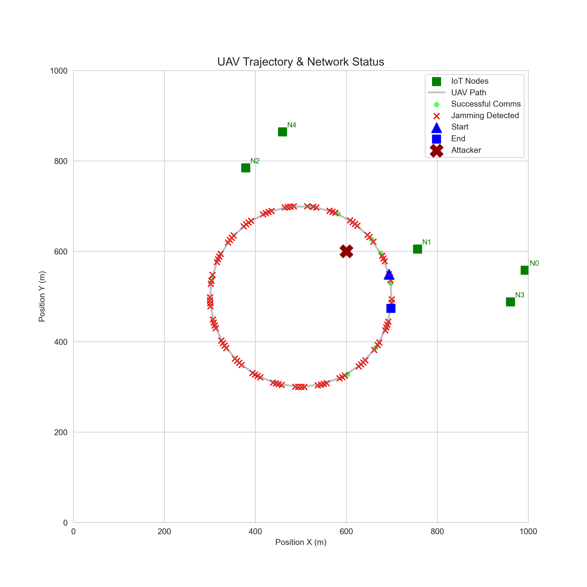
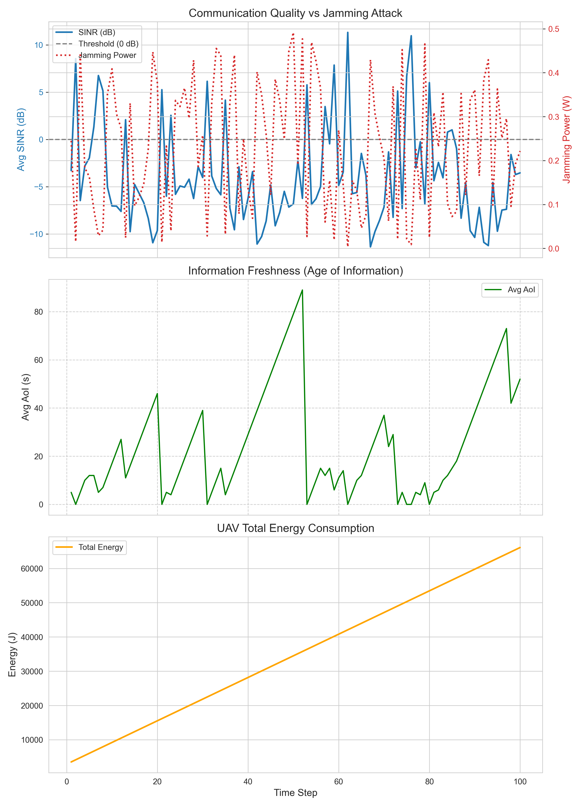

# Simülasyon Çalışma Akışı (Workflow)

Bu doküman, `UAV_IoT_Sim` projesinin çalışma mantığını adım adım açıklar.

## 1. Başlatma (Initialization) - `main.py`
Simülasyon `python main.py` komutuyla başlatıldığında sırasıyla şunlar gerçekleşir:

1.  **Logger Kurulumu (`SimulationLogger`)**:
    *   `logs/` klasörü altında o anki tarih/saat ile yeni bir klasör oluşturulur (Örn: `EXP_20260201_200542`).
    *   Simülasyon parametreleri `config.py`'den okunur ve bu klasöre `config.json` olarak kaydedilir.
    
2.  **Ortam Kurulumu (`UAV_IoT_Env`)**:
    *   `UAVAgent`: Belirlenen irtifada (100m) ve başlangıç konumunda oluşturulur.
    *   `IoTNode` (x5): Rastgele konumlara (1000x1000m alan içine) yerleştirilir.
    *   `SmartAttacker`: Sabit bir konuma yerleştirilir.
    
3.  **Görselleştirme (`Visualization`)**:
    *   Matplotlib penceresi açılır ve interaktif mod (`plt.ion()`) devreye girer.

## 2. Simülasyon Döngüsü (The Loop)
Simülasyon belirlenen adım sayısı (Varsayılan: 100) kadar döner. Her adımda (`env.step(action)`) şu işlemler yapılır:

### A. Aksiyon Seçimi (Action)
*   Şu an için rastgele bir **Jamming Gücü** (0 - 2 Watt arası) seçilir (İleride RL ajanı tarafından seçilecek).
*   Saldırganın gücü bu değere güncellenir.

### B. Fiziksel Hesaplamalar (`physics.py`)
1.  **İHA Hareketi**:
    *   İHA dairesel bir yörüngede (r=200m) hareket ettirilir.
    *   Yeni konum ve hız vektörü güncellenir.
2.  **Kanal ve İletişim**:
    *   **İHA -> Node** ve **Jammer -> Node** mesafeleri hesaplanır.
    *   `physics.calculate_path_loss` ile yol kayıpları bulunur.
    *   Her düğüm için **SINR** (Sinyal/Gürültü+Jamming) hesaplanır.
    *   Shannon denklemi ile anlık **Veri Hızı (Data Rate)** bulunur.

### C. Durum Güncellemeleri (`entities.py`)
1.  **Bağlantı Kontrolü**: Eğer SINR belirli bir eşiğin altındaysa (Örn: 1.0) düğüm "Jammed" (Engellenmiş) sayılır.
2.  **Bilgi Yaşı (AoI)**:
    *   Bağlantı varsa: AoI = 0 (Sıfırlanır).
    *   Bağlantı yoksa: AoI += geçen süre (Eskir).
3.  **Enerji Tüketimi**:
    *   **İHA**: Uçuş hızına bağlı aerodinamik güç harcaması hesaplanır.
    *   **IoT Node**: Veri gönderme ve şifreleme maliyetleri hesaplanır.

### D. Loglama (`logger.py`)
Her adımın sonunda tüm kritik veriler belleğe alınır:
*   Adım No
*   İHA ve Saldırgan Konumları
*   Her bir Node için: SINR, AoI, Harcanan Enerji
*   Saldırganın o anki gücü

### E. Görselleştirme (`render`)
*   Harita üzerindeki noktalar güncellenir.
*   Eğer saldırgan aktifse (Güç > 0.1W), etrafına kırmızı bir daire çizilir.
*   Ekrana anlık adım ve güç bilgisi yazılır.

## 3. Sonlandırma (Termination)
Döngü bittiğinde veya kullanıcı durdurduğunda:
1.  **Veri Kaydı**: Bellekteki tüm veriler `history.csv` dosyasına yazılır.
2.  Pencere kapatılır.
3.  Log dosyalarının konumu ekrana yazdırılır.

## 4. Analiz ve Görselleştirme - `visualizer.py`
Simülasyon bittikten sonra sonuçları grafiklemek için:
```bash
python visualizer.py
```
Bu komut, en son deney klasörünü bulur ve aşağıdaki grafikleri üretir.

### Sonuçların Yorumlanması (Örnek: EXP_20260201_200542)

Aşağıdaki grafikler, saldırı altındaki bir senaryonun örnek çıktılarıdır.

#### A. Yörünge ve Saldırı Analizi (`trajectory.png`)


*   **Mavi Çizgi**: İHA'nın izlediği dairesel rota.
*   **Kırmızı "X"**: Sabit saldırganın (Jammer) konumu.
*   **Kırmızı Noktalar**: İHA'nın bu noktalardayken iletişimin kesildiği (Jammed) anları gösterir.
    *   *Yorum:* İHA, saldırgana yaklaştıkça (sağ üst köşe) kırmızı noktaların yoğunlaşması, Jammer etkisinin mesafeyle arttığını doğrular.

#### B. Metrik Analizi (`metrics_analysis.png`)


Bu grafik üç panelden oluşur:

1.  **Üst Panel (SINR & Jamming):**
    *   **Mavi Çizgi (SINR):** Sinyal kalitesi.
    *   **Kırmızı Kesikli Çizgi (Jamming Power):** Saldırganın gücü.
    *   *Yorum:* Kırmızı çizgi yükseldiğinde (saldırı arttığında), mavi çizgi (SINR) ani düşüşler yaşar. 0 dB (Gri çizgi) altına inen noktalar bağlantı kopmasını ifade eder.

2.  **Orta Panel (Age of Information - AoI):**
    *   **Yeşil Çizgi:** Bilginin tazeliği (Düşük olması iyidir).
    *   *Yorum:* "Testere dişi" deseni görülür. Çizgi yukarı doğru tırmanırken (Lineer artış) veri alınamıyordur (Jamming veya uzaklık). Çizginin sıfıra düştüğü anlar, başarılı veri transferi anıdır.

3.  **Alt Panel (Energy):**
    *   **Turuncu Çizgi:** İHA'nın toplam enerji tüketimi.
    *   *Yorum:* Zamanla kümülatif olarak artar. Eğimin değişmesi, hız değişimlerine (Manevra) işaret eder.
