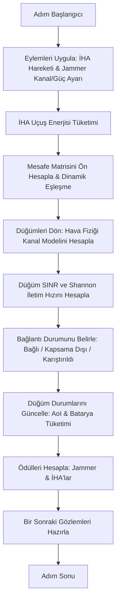

# İHA-IoT Karıştırma Simülasyonu: Adım Adım Çalışma Akışı ve Teknik Açıklamalar

Bu belge, PettingZoo ortamı içerisindeki simülasyon döngüsünün adım adım çalışma akışını, kod mantığıyla fiziksel formüllerin ve parametrelerin nasıl eşleştiğini açıklayan detaylı bir teknik kılavuzdur.

---

## 1. Sistem Parametreleri (Global Ayarlar)

Bu parametreler confs/config.py ve confs/env_config.py dosyalarından okunmaktadır:

### Fiziksel ve Çevresel Parametreler
| Parametre | Açıklama | Değer | Dosya Konumu |
| :--- | :--- | :--- | :--- |
| c | **Işık Hızı:** Yol kaybı hesabında dalga boyunu (dalga_boyu = c / f_c) hesaplamak amacıyla kullanılır. | 3e8 m/s | `UAVConfig.C` |
| B | **Kanal Bant Genişliği:** Shannon formülü ile telsiz bağlantısının anlık veri iletim hızını (R = B * log2(1 + SINR)) hesaplamak için kullanılır. | 2e6 Hz (2 MHz) | `UAVConfig.B` |
| N0_Linear | **Gürültü Tabanı:** SINR formülünün paydasındaki termal ve arka plan gürültü seviyesini temsil etmek için kullanılır. | -100 dBm (1e-13 W) | `UAVConfig.N0_Linear` |
| ETA | **Yol Kaybı Eksponenti:** Serbest uzay telsiz yayılım sönümlenmesini (Friis modeli) hesaplamak amacıyla kullanılır. | 2.0 (Serbest Uzay) | `UAVConfig.ETA` |
| H | **İHA Uçuş Yüksekliği:** İHA-IoT düğümü arasındaki 3-boyutlu mesafenin (d) hesaplanmasında dikey yüksekliği (Z koordinatı) sabitlemek için kullanılır. | 100.0 m | `UAVConfig.H` |
| P_TX_NODE | **IoT Düğümü İletim Gücü:** Düğümden İHA alıcısına gönderilen telsiz sinyal gücünü (P_rx_signal) hesaplamak amacıyla kullanılır. | 0.025 W (14 dBm) | `EnvConfig.P_TX_NODE` |
| P_TX_UAV | **İHA İletim Gücü:** İHA telsiz çıkış gücünü temsil eder. İleride iki yönlü haberleşme senaryoları için hazır tutulur. | 0.025 W (14 dBm) | `EnvConfig.P_TX_UAV` |
| MAX_JAMMING_POWER | **Maksimum Karıştırma Gücü:** Jammer'ın (saldırganın) uygulayabileceği maksimum RF çıkış karıştırma gücünü üstten sınırlamak için kullanılır. | 1.0 W (30 dBm) | `EnvConfig.MAX_JAMMING_POWER` |
| dt | **Simülasyon Adım Süresi:** İHA'ların o adımdaki katettiği mesafeyi (v * dt), tüketilen enerjileri ve düğümlerin AoI artışını güncellemek için kullanılır. | 5.0 s | `EnvConfig.STEP_TIME` |
| NUM_NODES | **Toplam IoT Düğümü Sayısı:** Simülasyondaki sabit yer düğümü adedini belirler, gözlem (state) ve eylem (action) uzaylarını yapılandırır. | 30 | `EnvConfig.NUM_NODES` |
| NUM_UAVS | **Toplam İHA Sayısı:** Simülasyonda eş zamanlı görev yapan İHA adedini belirler, rota paylaşım havuzunu ve durum vektörünü yapılandırır. | 1 | `EnvConfig.NUM_UAVS` |

### Ödül (Reward) Ağırlık Parametreleri
| Parametre | Açıklama | Değer | Kod Karşılığı / Dosya |
| :--- | :--- | :--- | :--- |
| w_success | **Jamming Başarı Ödülü:** Jammer'ın veri iletimini başarıyla keserek devre dışı bıraktığı (jamlediği) her bir düğüm başına kazandığı seyrek (sparse) ödülü belirler. | 10.0 | `reward_jam_success = jammed_count * 10` |
| w_tracking | **Kanal Takip Ödülü:** Jammer'ın en yakın İHA ile aynı frekans kanalında bulunmasını teşvik eden yoğun (dense) rehberlik ödülüdür. *Koşul:* Sadece jammer güç bastığında verilir. | 0.5 | `reward_tracking = 0.5` |
| w_cost | **Enerji Maliyet Cezası:** Jammer'ın gereksiz yere yüksek güç kullanmasını önlemek amacıyla, uyguladığı çıkış gücü seviyesini cezalandıran maliyet katsayısıdır. | 0.1 | `reward_energy_cost = cost * 0.1` |

### 8 Kanallı LoRaWAN EU868 Spektrumu
Taşıyıcı frekansları (f_c), `UAVConfig.CHANNELS` altında tanımlanmıştır (Semtech SX1261 datasheet verilerine göre +14 dBm'de Güç Amplifikatör verimliliği tüm kanallar için 0.298 olarak modellenmiştir):
- **Kanal 0:** 868.1 MHz
- **Kanal 1:** 868.3 MHz
- **Kanal 2:** 868.5 MHz
- **Kanal 3:** 867.1 MHz
- **Kanal 4:** 867.3 MHz
- **Kanal 5:** 867.5 MHz
- **Kanal 6:** 867.7 MHz
- **Kanal 7:** 867.9 MHz

---

## 2. Adım Adım Simülasyon Döngüsü (`step()`)

pettingzoo_env.py içerisindeki her bir simülasyon adımı (dt = 5.0 saniye) şu sırayla yürütülür:



---

## 3. Matematiksel Hesaplamalar ve Çekirdek Denklemler

### Adım 1: İHA Hareketi ve Uçuş Enerjisi Tüketimi
Kural tabanlı kontrolcü, her İHA için hız komutunu (v_x, v_y) hesaplar. İHA hızı V_max = 5.0 m/s ile sınırlandırılır.

#### A. Konum Güncelleme Denklemleri
```text
    x_uav(t + 1) = x_uav(t) + v_x * dt
    y_uav(t + 1) = y_uav(t) + v_y * dt
    
    burada hız büyüklüğü:  v = karekök( v_x² + v_y² )
```

#### B. İHA Güç Tüketim Modeli (P_fly)
Hız v değerine göre anlık güç tüketimi `physics.py` içerisinde hesaplanır:

* **1. Askıda Kalma Modu (Hovering) (v < 0.1 m/s):**
```text
    P_hover = P_0 + P_ind
            = 79.86 + 88.63
            = 168.49 Watt
```

* **2. Seyir Modu (Flight) (v >= 0.1 m/s):**
```text
                       /  3 * v²      \             v0       1
    P_fly(v) = P_0 *  |  -------- + 1  |  + P_ind * ----  +  - * d_0 * rho * s * A * v³
                       \  U_tip²      /              v       2
```
*Mekanik parametre değerleri yerine yerleştirildiğinde:*
```text
                       /    v²     \               4.03      1
    P_fly(v) = 79.86 * |  ------ + 1 |  + 88.63 * -------- + - * 0.6 * 1.225 * 0.05 * 0.5 * v³
                       \   4800    /                v        2
```
*Sadeleştirilmiş net formül:*
```text
                       v²           357.1789
    P_fly(v) = 79.86 * ---- + 79.86 + -------- + 0.0091875 * v³
                       4800              v
```

Bu adımdaki toplam İHA enerji artışı:
```text
    E_flight = P_fly(v) * dt  (Joule)
```

---

### Adım 2: Dinamik Düğüm İlişkilendirmesi
Her bir IoT düğümü için:
1. Tüm İHA'lara olan mesafeler (d_i_u) hesaplanır.
2. Düğüm en yakınındaki İHA ile dinamik olarak eşleşir.
3. Düğüm telsiz kanalı (c_node), İHA'nın o anki kanalıyla (c_uav) eşitlenir:
```text
    c_node = c_uav
```

---

### Adım 3: Hava Fiziği (Sinyal Fiziği ve Kanal Modeli)
d_uav düğüm-İHA mesafesini, d_jam düğüm-jammer mesafesini temsil eder.

#### 1. Yol Kaybı Katsayısı (Friis Modeli)
Seçilen kanal frekansı f_c için baz sönümleme katsayısı:
```text
                           1        /  4 * pi * f_c  \ -2
    beta_0(d, f_c) = ------------ * | -------------- |
                      eta_channel   \       c        /
```
*Değerler yerleştirildiğinde (eta = 2.0, c = 3e8):*
```text
                       1      /  4 * pi * f_c  \ -2
    beta_0(d, f_c) = ----- * | -------------- |
                      2.0     \   3 * 10^8     /
```

#### 2. Alınan Sinyal Gücü (P_rx_signal)
IoT Düğümünden İHA'ya ulaşan telsiz sinyal gücü:
```text
                     P_tx_node * beta_0(d_uav, f_c)
    P_rx_signal = -----------------------------------
                           maksimum(d_uav, 1.0)²
```

#### 3. Alınan Karıştırma Gücü (P_rx_jam)
Eğer jammer ve düğümün kanalı aynıysa (c_jam == c_node):
```text
                  P_jam_out * beta_0(d_jam, f_c)
    P_rx_jam = -----------------------------------
                       maksimum(d_jam, 1.0)²
```
*Not:* Eğer kanallar farklıysa karıştırma gücü P_rx_jam = 0 Watt kabul edilir.

#### 4. Eş-Kanal Girişimi (P_rx_co)
Aynı kanalı paylaşan diğer tüm verici düğümlerden kaynaklanan girişim:
```text
                  P_tx_node * beta_0(d_other_uav, f_c)
    P_rx_co = Toplam [ ------------------------------------ ]
                            maksimum(d_other_uav, 1.0)²
```

#### 5. SINR (Sinyal Girişim Gürültü Oranı)
```text
                           P_rx_signal
    SINR = -------------------------------------------
           N0_gürültüsü + P_rx_jam + P_rx_co + 1e-30
```
*Sayısal değerler yerleştirildiğinde:*
```text
                           P_rx_signal
    SINR = -------------------------------------------
           10^(-13) + P_rx_jam + P_rx_co + 1e-30
```

#### 6. Shannon Kapasitesi (Veri Hızı R)
Düğümün saniyede gönderebildiği veri miktarı (bps):
```text
    R = B * log2( 1 + SINR )
      = 2.000.000 * log2( 1 + SINR )
```

---

### Adım 4: Bağlantı Durumu Sınıflandırması
Her adımda düğümlerin haberleşme durumu şu şekilde kategorize edilir:
- **Başarılı Bağlantı (Status = 0):** SINR > 1.0 (0 dB) ise (İHA düğümün üstündeyken sinyal yeterince temiz).
- **Kapsama Dışı (Status = 1):** İHA düğümden çok uzaksa veya jammer olmasa bile telsiz sönümlemesi nedeniyle bağlantı kurulamıyorsa: SINR_saldırısız <= 1.0.
- **Karıştırıldı / Engellendi (Status = 2):** Normalde kurulabilecek bağlantı, jammer gücü nedeniyle kesildiyse: SINR_saldırısız > 1.0 ve SINR <= 1.0.

---

### Adım 5: Düğüm Durumlarının Güncellenmesi (AoI & Batarya Tüketimi)

#### A. Bilgi Yaşı (Age of Information - AoI)
```text
    Bağlantı Başarılı ise (Status = 0):  AoI(t + 1) = 0
    Bağlantı Başarısız ise (Status > 0): AoI(t + 1) = AoI(t) + dt
```

#### B. Düğüm Enerji Tüketimi (E_iot)
Her adımda bir düğümün harcadığı enerji miktarı:
```text
    E_iot = E_acq + P_tx_node * t_tx + P_enc * ( L_p * t_enc )
```
*Sayısal değerler yerleştirildiğinde (E_acq=10^-5, P_tx=0.025, L_p=1024, P_enc=0.01, t_enc=10^-4):*
```text
    E_iot = 0.00001 + 0.025 * t_tx + 0.01 * ( 1024 * 0.0001 )
          = 0.00001 + 0.025 * t_tx + 0.001024 Joule
```
*Burada iletim süresi (t_tx):*
```text
             1024
    t_tx = -------- saniye  (Eğer hız R > 10^-9 ise)
              R
              
    t_tx = 10.0 saniye      (Eğer hız R <= 10^-9 ise - Bağlantı Yok/Timeout)
```

---

### Adım 6: Ödül (Reward) Hesaplama

#### A. İHA Takımı Ödülü
```text
    r_uav = - ( Jamlenen_Düğüm_Sayısı )
```

#### B. Saldırgan (Jammer) Ödülü
```text
    r_jammer = r_başarı + r_takip - r_maliyet
```
*Burada alt bileşenler:*
```text
    r_başarı  = Jamlenen_Düğüm_Sayısı * 10.0
    
    r_takip   = 0.5   (Eğer Jammer kanalı == En yakın İHA kanalı VE Jammer gücü > 0.01 W ise)
    r_takip   = 0.0   (Aksi takdirde)
    
    r_maliyet = Jammer_Çıkış_Gücü * 0.1
```

---

### Adım 7: Gözlem Durum Vektörü (State)
DRL ajanlarına beslenen durum vektörünün normalizasyon yapısı (M=3 İHA ve N=30 düğüm için toplam 37 boyutlu, M=1 için 33 boyutlu):
```text
                    [ İHA Uzaklıkları ] ---> 3 değer  ( Mesafe / 1000, RSSI proxy )
                    [ İHA Kanalları   ] ---> 3 değer  ( 0 - 7 arası kanal indeksi )
    State (37-D) =  [ Jammer Kanalı   ] ---> 1 değer  ( 0 - 7 arası kanal indeksi )
                    [ Düğüm RSSI'leri ] ---> 30 değer ( Telsiz Sinyal Gücü, normalize )
```

---

## 4. Düğümlerin, İHA'ların ve Jammer'ın Başlangıç Konumları

Simülasyon sıfırlandığında (reset fonksiyonu çağrıldığında), tüm varlıkların koordinatları şu mantığa göre belirlenir:

### A. IoT Düğümlerinin Yerleşimi (Node Placement)
Toplam düğüm sayısı (NUM_NODES = 30) kadar düğüm, 1000m x 1000m boyutlarındaki simülasyon alanı içerisine rastgele dağıtılır.
- Her bir düğümün X ve Y koordinatları, 0 ile 1000 metre arasında Düzgün Dağılım (Uniform Distribution) kullanılarak rassal olarak belirlenir.
- Formülsel olarak:
```text
    x_node = Uniform(0, AREA_SIZE)
    y_node = Uniform(0, AREA_SIZE)
    z_node = 0.0 (Yer seviyesi)
```
- Bu işlem, her sıfırlamada düğüm konumlarının farklı olmasını sağlayarak modelin genelleştirme yeteneğini test eder.

### B. İHA'ların Başlangıç Konumları (UAV Initialization)
İHA'lar, simülasyon alanının ana köşegeni (diagonal) üzerine eşit aralıklarla yerleştirilir:
- Her bir İHA (i. indeksli) için X ve Y koordinatları şu şekilde atanır:
```text
    spacing = (i + 1) * (AREA_SIZE / (NUM_UAVS + 1))
    x_uav = spacing
    y_uav = spacing
    z_uav = 100.0 (Uçuş yüksekliği - sabit)
```
- Örneğin 1 İHA varsa: spacing = 1 * (1000 / 2) = 500, dolayısıyla İHA (500.0, 500.0, 100.0) konumunda (alanın tam merkezinde) başlar.
- Örneğin 2 İHA varsa: ilk İHA (333.3, 333.3, 100.0), ikinci İHA (666.6, 666.6, 100.0) konumunda başlar.

### C. Saldırganın (Jammer) Başlangıç Konumu (Jammer Placement)
Jammer (saldırgan), simülasyon alanında sabit bir konuma yerleştirilir ve simülasyon boyunca yer değiştirmez:
```text
    x_jammer = 600.0
    y_jammer = 600.0
    z_jammer = 0.0 (Yer seviyesi)
```

---

## 5. İHA Rota Yönetimi, Askıda Kalma ve Kanal Atlama Mekanizmaları

İHA'ların hareket komutları (vx, vy), kural tabanlı bir kontrolcü (UAVRuleBasedController) tarafından yönetilir. Kontrolcü, aşağıdaki mekanizmaları işleterek düğümlerden veri toplar:

### A. Dinamik ve İş Birlikçi Rota Seçimi (Cooperative Waypoint Selection)
Birden fazla İHA olması durumunda İHA'lar birbirlerinin hedeflerini çakıştırmadan dinamik rota paylaşımı yaparlar:
1. Simülasyon başlangıcında tüm düğüm ID'leri "ziyaret edilmemiş düğümler" (unvisited_nodes) kümesinde toplanır.
2. Bir İHA yeni hedef seçeceği zaman:
   - Ziyaret edilmemiş olan ve o anda başka hiçbir İHA tarafından hedeflenmemiş (targeted_nodes listesinde olmayan) düğümleri listeler.
   - Bu aday düğümler arasından kendi anlık konumuna en yakın olanını (Öklid mesafesiyle) hedef düğüm (target_node) olarak seçer.
3. Eğer boşta (diğer İHA'ların hedeflemediği) düğüm kalmadıysa ancak hala ziyaret edilmemiş düğümler varsa, diğerlerinin hedeflediği düğümleri de havuzuna katarak en yakın olana yönelir.
4. Eğer sahadaki tüm düğümler ziyaret edildiyse, "ziyaret edilmemiş düğümler" listesi otomatik olarak tekrar 30 düğümle sıfırlanır ve İHA'lar veri toplama döngüsüne yeniden başlar.

### B. Uçuş Hareketi ve Varış Eşiği (Navigation & Speed Limits)
- İHA hedef düğümüne doğru saniyede 5.0 metre sabit uçuş hızıyla (UAV_SPEED) doğrudan uçar.
- Yapay Potansiyel Alanı (APF) tabanlı engellerden kaçınma algoritmaları, simülasyonun adım hızını artırmak ve gereksiz manevraları önlemek amacıyla devre dışı bırakılmıştır. İHA doğrudan hedefe yönelir.
- İHA'nın hedef düğümle olan yatay (XY) Öklid mesafesi varış eşiğinin altına düştüğünde İHA hedefe ulaşmış sayılır:
```text
    Varış Eşiği (arrival_threshold) = en_büyük( 10.0, (UAV_SPEED * dt) * 1.1 )
```
- Varsayılan dt = 5.0 sn ve UAV_SPEED = 5.0 m/s için varış eşiği en_büyük(10.0, 27.5) = 27.5 metredir.

### C. Askıda Kalma ve Veri Toplama Davranışı (Hovering State)
- İHA hedef düğümün varış eşiğine girdiğinde askıda kalma moduna (is_hovering = True) geçer.
- Askıda kalma süresi 5.0 saniyedir (tam olarak 1 simülasyon adımı, dt).
- Askıda kalma esnasında:
  - İHA'nın hızı v = 0 m/s olur ve askıda kalma güç tüketimi (P_hover) seviyesinde enerji harcar.
  - Düğüm ile İHA arasında veri iletimi gerçekleştirilir. Eğer SINR eşiği aşılırsa veri aktarımı başarılı olur ve düğümün bilgi yaşı (AoI) 0.0'a sıfırlanır.
- Askıda kalma süresi (5.0 sn) dolduğunda, ilgili düğüm "ziyaret edilmemiş düğümler" kümesinden çıkartılır, İHA'nın hedefi sıfırlanır ve İHA bir sonraki en yakın hedefi seçerek uçmaya devam eder.

### D. Kanal Atlama ve Karıştırma Reaksiyonu (Markov Channel Hopping)
İHA, hedef düğümün bağlantı kalitesini izler ve jammer saldırılarına karşı aktif olarak frekans değiştirir:
- Eğer İHA'nın hedefindeki düğüm art arda 2 adım (PERSISTENCE_THRESHOLD) boyunca jammer tarafından başarıyla karıştırılırsa (Status = 2 ise), İHA kanal atlama mekanizmasını tetikler.
- Yeni kanal, İHA'nın o anki kanalına bağlı olarak bir Markov Geçiş Matrisi (transition_matrix) yardımıyla rassal olarak seçilir:
  - **3 Kanallı Senaryoda Geçiş Olasılıkları:**
    ```text
    Kanal 0'dan geçiş -> [0.1, 0.7, 0.2]  (Kanal 1'e geçişi tercih eder)
    Kanal 1'den geçiş -> [0.2, 0.1, 0.7]  (Kanal 2'ye geçişi tercih eder)
    Kanal 2'den geçiş -> [0.7, 0.2, 0.1]  (Kanal 0'a geçişi tercih eder)
    ```
  - **N Kanallı Genel Senaryoda Geçiş Olasılıkları:**
    - Kendi kanalında kalma olasılığı: %10
    - Bir sonraki kanala geçme olasılığı (i + 1): %60
    - Kalan tüm kanallara eşit paylaştırılan toplam olasılık: %30
- Kanal değiştirildikten sonra ardışık karıştırma adımları sayacı sıfırlanır.
