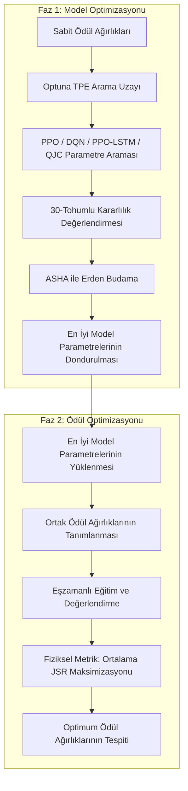

# Hiperparametre ve Ödül Fonksiyonu Optimizasyonu (Hyperparameter and Reward Function Optimization)

Geliştirilen İnsansız Hava Aracı (İHA) tabanlı akıllı karıştırıcı (intelligent jammer) sisteminin başarısı, hem derin pekiştirmeli öğrenme (DRL) modellerinin ağ yapılarına hem de optimize edilmesi gereken çok amaçlı ödül fonksiyonunun (multi-objective reward function) ağırlıklarına doğrudan bağlıdır. Karşılaştırmalı analizlerin akademik geçerliliğini ve adilliğini garanti altına almak amacıyla, optimizasyon süreci literatürdeki geleneksel yöntemlerin aksine **iki aşamalı (two-phase)** bir metodolojiyle yürütülmüştür.

---

## 1. İki Aşamalı Optimizasyon Metodolojisi

Pekiştirmeli öğrenmede ödül fonksiyonunun ağırlıkları değiştirildiğinde, ajanın elde ettiği ödüllerin sayısal ölçeği (scale) de değişir. Bu durum, model mimarisi arama sürecinde kararsızlıklara ve adil olmayan karşılaştırmalara yol açar. Bu kısıtın aşılması için süreç şu şekilde tasarlanmıştır:

---

## 2. Faz 1: Model Hiperparametrelerinin Optimizasyonu (Phase 1: Model HPO)

İlk aşamada, çevre ve ödül ağırlıkları varsayılan değerlerinde sabitleştirilmiştir ($W_{\text{success}} = 0.8$, $W_{\text{tracking}} = 0.2$, $W_{\text{cost}} = 0.03$). Buradaki amaç, her algoritmanın problem uzayını en iyi şekilde öğrenebileceği ağ yapısını ve hiperparametre setini bağımsız olarak bulmaktır.

### 2.1. Arama Algoritması ve Budama (Search & Pruning)
Arama sürecinde ardışıl denemeleri optimize etmek için **Ağaç Yapılı Parzen Tahmincisi (Tree-structured Parzen Estimator - TPE)** bayesçi optimizasyon algoritması kullanılmıştır. Eğitim sürelerini kısaltmak ve verimsiz parametreleri erken aşamada elemek amacıyla **Asenkron Ardışıl Yarıya İndirme (Asynchronous Successive Halving Algorithm - ASHA)** zamanlayıcısı (scheduler) entegre edilmiştir. 
* **Bütçe:** Her deneme (trial) maksimum $1000$ eğitim iterasyonu ($1.0 \times 10^6$ çevresel adım) boyunca çalıştırılır.
* **Erken Durdurma:** ASHA, ilk $500$ iterasyon boyunca modellerin budanmasına izin vermez (kararlı yakınsama süresi). $500$. iterasyondan sonra vaatkar görünmeyen (düşük performanslı) denemeler otomatik olarak sonlandırılır.

### 2.2. Dayanıklılık ve Kararlılık Değerlendirmesi (Robustness Evaluation)
Pekiştirmeli öğrenme modellerinin rastgele tohumlara (random seeds) olan hassasiyetini ve aşırı uyum (overfitting) riskini ortadan kaldırmak için, her denemenin sonunda elde edilen en iyi politika $30$ farklı rastgele tohum ($seed \in [100, 129]$) altında **dayanıklılık değerlendirmesine (robustness evaluation)** tabi tutulur. Optuna algoritmasına bildirilen hedef (objective) değeri, bu 30 testin ortalama ödülü ($\text{Mean Episode Reward}$) olarak hesaplanır:

$$\text{Objective}_{\text{Phase 1}} = \frac{1}{30} \sum_{s=100}^{129} G_s$$

Burada $G_s$, $s$ tohumu ile başlatılan değerlendirme epizodunda akıllı karıştırıcının topladığı kümülatif ödüldür.

### 2.3. Arama Uzayları (Search Spaces)
Karşılaştırmanın adil olması için tüm derin pekiştirmeli öğrenme modelleri (PPO, DQN ve PPO-LSTM) ortak öğrenme ve iskonto oranı sınırlarını paylaşmaktadır. Arama uzayı sınırları şu şekildedir:

* **Ortak Parametre Sınırları (PPO, DQN, PPO-LSTM):**
  * **Öğrenme Oranı ($lr$):** $\log(10^{-5})$ ile $\log(10^{-3})$ arasında log-uniform dağılım.
  * **İskonto Oranı ($\gamma$):** $0.85$ ile $0.99$ arasında uniform dağılım.
  * **Ağ Mimarisi ($\text{architecture}$):** $128$, $256$ ve $512$ nöronlu gizli katmanların 1, 2 ve 3 katmanlı tüm olası permütasyonlarından oluşan $39$ farklı kategorik kombinasyon (örn. $[128, 512]$, $[512, 256, 128]$ vb. derin sığ, genişleyen, daralan ve darboğaz mimariler).

* **Algoritmaya Özel Parametre Sınırları:**
  * **DQN:** Hedef ağ güncelleme frekansı ($f_{\text{target}} \in \{200, 500, 1000, 2000\}$).
  * **PPO-LSTM:** LSTM hücre boyutu ($N_{\text{cell}} \in \{16, 32, 64, 128\}$) ve geriye dönük zaman penceresi ($L_{\text{seq}} \in \{5, 10, 20\}$).
  * **QJC (Tabular Baseline):** Başlangıç öğrenme hızı ($\tau_0 \in [10^{-5}, 10^{-3}]$), iskonto oranı ($\gamma \in [0.85, 0.99]$), Softmax sıcaklık katsayısı ($\xi \in [1.0, 10.0]$) ve logaritmik kazanç sabiti ($\mu_{\text{offset}} \in [1.0, 2.0]$).

---

## 3. Faz 2: Birleşik Ödül Fonksiyonu Optimizasyonu (Phase 2: Joint Reward Tuning)

Faz 1 tamamlandıktan sonra, her algoritmanın en iyi parametreleri dondurulur ve `{project_root}/confs/tuned_configs.json` dosyasına kaydedilir. Faz 2'de bu optimum konfigürasyonlar yüklenir ve ortak ödül ağırlıkları aranır:

$$\text{Reward} = W_{\text{success}} \cdot R_{\text{jamming}} + W_{\text{tracking}} \cdot R_{\text{tracking}} - W_{\text{cost}} \cdot R_{\text{power\_cost}}$$

Burada $W_{\text{tracking}} = 1.0 - W_{\text{success}}$ olarak dinamik hesaplanır.

### 3.1. Ortak Hedef Fonksiyonu (Unified Objective)
Farklı ödül ağırlıkları altında pekiştirmeli öğrenme modellerinin aldığı sayısal ödüller birbiriyle kıyaslanamaz. Bu sebeple, Faz 2'deki hedef fonksiyonu olarak soyut ödül değerleri yerine fiziksel bir metrik olan **Karıştırma Başarı Oranı (Jamming Success Rate - JSR)** kullanılmıştır. 

Karşılaştırmanın tarafsızlığını korumak için, her denemede (trial) önerilen $(W_{\text{success}}, W_{\text{cost}})$ çifti ile PPO, DQN, PPO-LSTM ve QJC modelleri sıfırdan eğitilir ve 30 tohumda test edilir. Arama algoritmasının maksimize etmeye çalıştığı nihai değer, bu 4 farklı algoritmanın ortalama JSR başarısıdır:

$$\text{Objective}_{\text{Phase 2}} = \text{mean}\left(\overline{\text{JSR}}_{\text{PPO}}, \overline{\text{JSR}}_{\text{DQN}}, \overline{\text{JSR}}_{\text{PPO-LSTM}}, \overline{\text{JSR}}_{\text{QJC}}\right)$$

* **Arama Sınırları:**
  * **$W_{\text{success}}$:** $0.5$ ile $0.95$ arasında uniform dağılım (karıştırma önceliği).
  * **$W_{\text{cost}}$:** $0.005$ ile $0.1$ arasında log-uniform dağılım (güç tasarrufu dengesi).

---

## 4. Dağıtık Hesaplama ve Kaynak Yönetimi (Distributed Infrastructure)

Dağıtık pekiştirmeli öğrenme eğitimleri, $1$ adet Head Node (koordinatör) ve $12$ adet fiziksel Worker Node'dan oluşan yerel bir Ray kümesinde (Ray Cluster) koşturulmuştur. Kümedeki işçi (worker) düğümlerinin her biri yüksek performanslı **Intel Core Ultra 9** işlemci ve **NVIDIA RTX 3060** grafik işlem birimi (GPU) donanımına sahiptir.

### 4.1. STRICT_PACK Kaynak İzolasyonu
İşçi makinelerin her biri $22$ CPU thread'i (Core Ultra 9) ve $1$ adet GPU (RTX 3060) barındırmaktadır. Denemelerin birbirlerinin kaynaklarını gasp ederek (CPU/VRAM çekişmesi) eğitim sürelerini yapay olarak uzatmasını ve ASHA budayıcısını yanıltmasını önlemek için şu strateji izlenmiştir:
* Her deneme için `num_workers = 10` (Core Ultra 9 üzerinde paralel çalışan 10 adet CPU env runner) ve `num_gpus = 1.0` (RTX 3060 GPU'nun tamamı) tahsis edilmiştir. 
* Learner süreci için de $1$ CPU ayrılarak trial başına toplam kaynak ihtiyacı **$11$ CPU ve $1$ GPU** olarak sabitlenmiştir.
* `STRICT_PACK` yerleşim kuralı uygulanarak, bir denemeye ait tüm bu süreçlerin (11 CPU + 1 GPU) **aynı fiziksel makineye sıkıştırılması** sağlanmıştır. Bu sayede makineler arası ağ gecikmeleri (network latency) sıfıra indirilmiş, her makinede kalan 11 CPU ise izole boşta bırakılmıştır.

### 4.2. Eşzamanlı Deneme Yönetimi
Kümedeki 12 fiziksel makineden maksimum verim almak adına, Phase 1 aşamasında PPO, DQN ve PPO-LSTM algoritmaları **3 ayrı terminalde eşzamanlı olarak** başlatılır. Her algoritma için `--max-concurrent 4` sınırı verilerek, cluster kaynakları (4 + 4 + 4 = 12 makine) adil bir şekilde paylaştırılır ve tüm donanım %100 yük altında paralel çalıştırılır.
